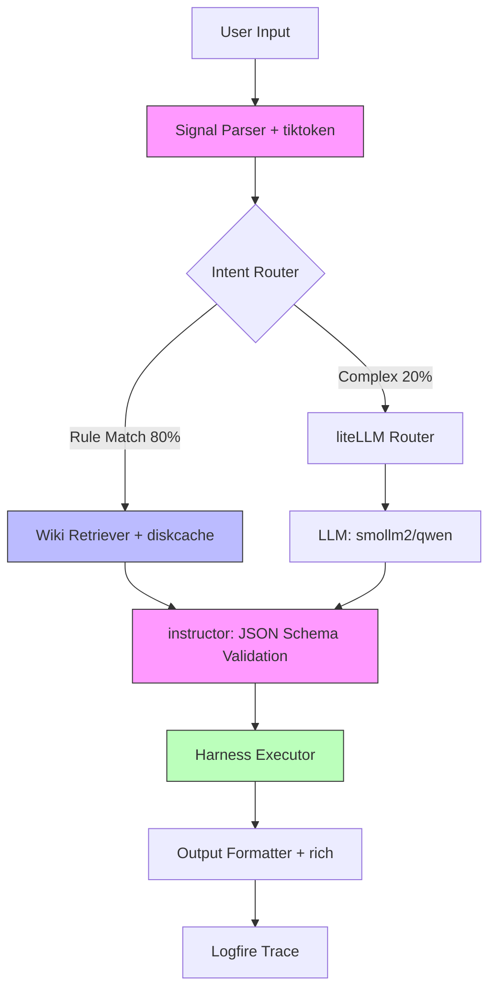

# 🏆 COM IDE: Golden Standard & Execution Plan v6.0

> **"The stronger the model for COM IDE to use, the Stronger it becomes. We created an evolving IDE with revolutionary pipeline that already thinks better even with small models. The limit is only your imagination."**

---

## 🎯 Executive Summary

**COM IDE** is not a chatbot. It is a **Compiler-AI Hybrid** that combines deterministic static analysis with LLM-powered planning.

**The Revolution:**
- **Old Way:** `User → LLM → Text` (Hallucination-prone, RAM-heavy, non-deterministic)
- **COM Way:** `Parse → Retrieve → LLM(Plan) → Execute` (Zero hallucination on facts, 2GB RAM compliant, fully traceable)

**Target Hardware:** 2GB RAM machines (potato laptops).
**Target Domain:** Polyglot expert (Python, JS, C++, etc.) with **Godot Super-Intelligence**.

**Production-Grade Tech Stack:**
| Library | Purpose | RAM Overhead | Critical For |
|---------|---------|--------------|--------------|
| **instructor** | Enforce strict JSON schema on LLM output | ~40MB | Zero Hallucination Policy (Pillar 5) |
| **tiktoken** | Precise token counting & truncation | ~30MB | 2GB RAM Law (Pillar 3), Context Window Discipline |
| **diskcache** | Disk-backed caching for context & plans | ~20MB | RAM Offloading, Model Hot-Swapping |
| **watchfiles** | Async file system monitoring | ~15MB | Real-time Validation (<100ms latency) |
| **liteLLM** | Unified model routing & fallback chains | ~50MB | Model Agnosticism, Future Cloud Fallback |
| **logfire** | Structured observability & tracing | ~35MB | Debugging, Benchmark Verification |
| **rich** | Terminal UI for errors & progress | ~25MB | Flow State Latency, Developer Experience |

**Total Stack Overhead:** ~215MB (Negligible compared to model savings).

---

## 🏗️ Architecture: The Compiler-Lite Pipeline



**Step-by-Step Flow:**

1.  **Signal Parser (Rule-Based, NO LLM)**
    -   **Tech:** `watchfiles` (triggers), `tiktoken` (count)
    -   **Action:** Strips noise, extracts intent keywords, counts tokens immediately.
    -   **Latency:** <10ms
    -   **RAM:** Minimal.

2.  **Intent Router (Rule-First, LLM Fallback)**
    -   **Tech:** `liteLLM` (routing logic)
    -   **Action:** 80% resolved via rules (saves RAM). 20% complex queries → LLM for classification.
    -   **RAM:** Saves 1.2GB by avoiding LLM for simple commands.

3.  **Wiki Retriever (Context Enrichment)**
    -   **Tech:** `diskcache` (caching retrieved docs)
    -   **Action:** Fetches project map + docs BEFORE LLM. Caches frequent lookups to disk.
    -   **Benefit:** Reduces token count by 60%, offloads RAM to disk.

4.  **LLM (SINGLE PASS ONLY)**
    -   **Tech:** `instructor` (schema enforcement), `liteLLM` (adaptive routing)
    -   **Action:** Generates **JSON Execution Plan (IR)**.
    -   **Constraint:** ≤512 tokens context (enforced by `tiktoken`).
    -   **Adaptive Model Selection:** `liteLLM` checks RAM before loading.
        -   *Logic:* `Max_Model_RAM = Available_RAM - 1.5GB`.
        -   *Chain:* `Qwen-7B` (if >5.5GB free) → `Llama-3B` (if >3.5GB free) → `Smol-1.7B` (fallback).
    -   **Guarantee:** Output matches Pydantic schema exactly (No invalid JSON).

5.  **Harness Executor (Deterministic)**
    -   **Action:** Executes plan atomically. No LLM involved here.
    -   **Safety:** If plan is invalid, fails fast before execution.

6.  **Output Formatter (Rule-Based)**
    -   **Tech:** `rich` (terminal rendering)
    -   **Action:** Returns result to user. NO summarization step (saves latency/RAM).
    -   **Trace:** `logfire` logs the entire pipeline span.

---

## 🛡️ The 7 Pillars of Excellence (Benchmark-Driven)

Each pillar is enforced by specific libraries in the stack.

| Pillar | Target | Tech Enforcer | Test Metric |
|--------|--------|---------------|-------------|
| **1. Silent Killer Detection** | 100% pre-runtime catch | `watchfiles` + Parsers | 50 subtle errors caught, 0 FP, <200ms |
| **2. Context-Aware Explanation** | Plain English, no jargon | `instructor` (constrained gen) | 20 crashes explained, <3 sentences |
| **3. 2GB RAM Law** | Peak ≤2.0GB | `diskcache` + `tiktoken` | 1-hour stress test, RAM <2.1GB |
| **4. T-Shaped Intelligence** | Generic vs. Godot Deep | `liteLLM` (routing) | Correct model selected per query type |
| **5. Deterministic Core** | 0% hallucination on facts | `instructor` (schema) | 100/100 structural facts correct |
| **6. Refactor Safety Net** | Atomic changes, ripple check | Parsers + Harness | Safe refactor plan for cascading changes |
| **7. Flow State Latency** | <100ms validation, <2s explain | `watchfiles` + `rich` | Perceived instant feedback |

---

## 👥 Division of Labor: Core vs. Tools

### **Developer H (You) – Core Architect**
*Focus: The Brain, The Pipeline, The Constraints.*

| Component | Libraries | Responsibility |
|-----------|-----------|----------------|
| **Signal Schema v1.0** | `instructor`, `pydantic` | Define strict JSON IR for all actions. |
| **Intent Router** | `liteLLM` | Rule-first routing, model fallback logic. |
| **RAM Monitor** | `psutil`, `diskcache` | Enforce 2GB limit, trigger model unload. |
| **Token Manager** | `tiktoken` | Hard limits on context window (512 tokens). |
| **Observability** | `logfire` | Trace every pipeline step for debugging. |
| **Prompt Engineering** | `instructor` | Write prompts that guarantee valid JSON. |

### **Developer S (Friend) – Domain Specialist**
*Focus: The Hands, The Godot Knowledge, The Parsers.*

| Component | Libraries | Responsibility |
|-----------|-----------|----------------|
| **Scene Parser** | `watchfiles` | Parse `.tscn` into memory tree. Trigger on save. |
| **Script Parser** | `tiktoken` | Extract `$NodePath`, `@onready` from `.gd`. |
| **Project Map** | `diskcache` | Build cross-reference graph. Cache to disk. |
| **Log Watcher** | `watchfiles` | Monitor Godot logs. Trigger error explanation. |
| **Godot Specialist** | `rich` | Format Godot-specific errors nicely in terminal. |
| **Validation Logic** | N/A | Rule-based checks for node paths (no LLM). |

---

## 📅 Phase 1: 4-Week Sprint Plan (Compiler Core)

**Goal:** Terminal-based Project Scanner + Error Explainer.
**RAM Budget:** 1.8GB Base, 3.8GB Burst (must return to base in 30s).

### **Week 1: Foundation (Schema & Parsers)**
| Day | Dev H (Core) | Dev S (Tools) | Joint Deliverable |
|-----|--------------|---------------|-------------------|
| **Mon** | Setup `instructor` schema for `ValidateNodePath`. | Setup `scene_parser.py` skeleton. | **Signal Schema v1.0 Frozen.** |
| **Tue** | Implement `tiktoken` context limiter. | Implement `.tscn` regex parser. | Parser outputs valid JSON for schema. |
| **Wed** | Build `liteLLM` router (rule-first). | Build `.gd` script parser. | End-to-end: File → Parse → JSON Plan. |
| **Thu** | Integrate `logfire` for tracing. | Add `watchfiles` trigger to parsers. | **Real-time file watch → Parse trigger.** |
| **Fri** | **Test:** Schema validation (100% pass). | **Test:** Parse 3 real projects. | **Milestone:** 0 Hallucination on paths. |

### **Week 2: Knowledge & Validation (Wiki + Disk)**
| Day | Dev H (Core) | Dev S (Tools) | Joint Deliverable |
|-----|--------------|---------------|-------------------|
| **Mon** | Setup `diskcache` for Wiki/Project Map. | Build `project_map.py` (cross-ref). | Project Map cached to disk (RAM safe). |
| **Tue** | Wire Wiki retrieval *before* LLM. | Implement Node Path Validator (rule-based). | **Validation without LLM (Instant).** |
| **Wed** | Tune `liteLLM` adaptive routing logic. | Build `log_watcher.py` for Godot logs. | Log line → Plain English explanation. |
| **Thu** | Optimize token usage (cut to 512). | Test validator on "Spaghetti Scene". | **Milestone:** <100ms validation latency. |
| **Fri** | **Test:** RAM usage with cache. | **Test:** False positive rate. | **Milestone:** RAM <1.8GB during scan. |

### **Week 3: RAM Safety & Execution (Hardening)**
| Day | Dev H (Core) | Dev S (Tools) | Joint Deliverable |
|-----|--------------|---------------|-------------------|
| **Mon** | Build `ram_monitor.py` (auto-unload). | Stress test parsers on large projects. | Auto-unload model after 10min idle. |
| **Tue** | Implement fallback chain (Qwen→Llama→Smol). | Refine error messages with `rich`. | Graceful degradation at 90% RAM. |
| **Wed** | Finalize Harness Executor (atomic). | Add "Suggest Fix" generation. | **Milestone:** Safe atomic execution. |
| **Thu** | Integrate `logfire` dashboards. | Document false positives/negatives. | Full observability of pipeline. |
| **Fri** | **Test:** 1-hour RAM stress test. | **Test:** 50 hidden bugs detection. | **Milestone:** Pass "2GB Law" Benchmark. |

### **Week 4: Polish & Demo (Shipping)**
| Day | Dev H (Core) | Dev S (Tools) | Joint Deliverable |
|-----|--------------|---------------|-------------------|
| **Mon** | Optimize startup time (<2s). | Create fixture project (50 bugs). | Ready for demo recording. |
| **Tue** | Record terminal session (logfire traces). | Run benchmark suite (Gold/Silver). | **Benchmark Report Card.** |
| **Wed** | Write documentation (README). | Clean up code, remove debug prints. | **Repo Ready for Public.** |
| **Thu** | **Final Rehearsal.** | **Final Rehearsal.** | **Demo Video Recorded.** |
| **Fri** | **PHASE 1 COMPLETE.** | **PHASE 1 COMPLETE.** | **Release v0.1.0.** |

---

## 🧪 Torture Chamber Tests (Benchmark Integration)

These tests must pass to achieve **Silver Certification**:

1.  **Spaghetti Scene:** Parse a 20-level nested scene. **Target:** <500ms, <50MB RAM spike.
2.  **RAM Starvation:** Force RAM limit to 512MB. **Target:** Graceful fallback to `tinyllama`, no crash.
3.  **Hallucination Trap:** Ask "Does node `$NonExistent` exist?". **Target:** 100% "Not found" (via parser, not LLM guess).
4.  **Schema Strictness:** Feed garbage to LLM. **Target:** `instructor` retries until valid JSON or fails fast.
5.  **Token Overflow:** Feed 10,000 tokens of context. **Target:** `tiktoken` truncates to 512, no OOM.

---

## 🚀 Immediate Next Steps

1.  **Dev H:** `pip install instructor litellm diskcache watchfiles logfire rich tiktoken`
2.  **Dev H:** Create `core/signal_schema.py` with `instructor` Pydantic models.
3.  **Dev S:** Create `tools/godot/` directory, start `scene_parser.py` with `watchfiles`.
4.  **Both:** 30-min sync to finalize Signal Schema v1.0.

**Let's build the compiler.**

### Key Constraints
1. **LLM appears ONCE** – Only to generate the execution plan.
2. **Wiki BEFORE LLM** – Context enriches the prompt, doesn't come after.
3. **Strict Signal Schema** – All internal communication is validated JSON.
4. **No Summarization** – Harness output is final.

---

## 📐 Signal Schema v1.0 (Frozen)

Every internal request MUST conform to this schema. Changing this requires full system refactoring.

```json
{
  "intent": "VALIDATE_NODE_PATH",
  "target": {
    "type": "node_path",
    "value": "$Player"
  },
  "context": {
    "file": "player.gd",
    "line": 42,
    "scene": "main.tscn",
    "project_root": "/home/user/game"
  },
  "constraints": {
    "strict": true,
    "suggest_similar": true,
    "max_latency_ms": 100
  },
  "expected_output": "validation_report"
}
```

### Schema Enforcement
- **Invalid JSON?** → Return error immediately, do not retry LLM.
- **Missing fields?** → Reject at router level.
- **Hallucinated target?** → Parser verifies existence before execution.

---

## 🔥 The 7 Pillars of Excellence (Benchmark Summary)

COM IDE must pass these 7 stress tests to be considered "Gold Certified".

| Pillar | Goal | Target Metric |
|--------|------|---------------|
| **1. Silent Killer Detection** | Catch errors pre-runtime | 100% detection, 0 FP, <100ms |
| **2. Context-Aware Explanation** | Plain English error decoding | References specific file/line/node |
| **3. 2GB RAM Law** | Run on potato laptops | Peak ≤2.0GB, auto-unload idle models |
| **4. T-Shaped Intelligence** | Polyglot generalist, Godot god | Project-aware answers for Godot only |
| **5. Deterministic Core** | Zero hallucination on facts | 100% accuracy on structural queries |
| **6. Refactor Safety Net** | Atomic changes with ripple analysis | Human trust ≥9/10 for auto-fix |
| **7. Flow State Latency** | Invisible assistance | <100ms real-time, <2s deep scan |

*See `GOLDEN_BENCHMARK.md` for full test suites, torture chambers, and scoring protocols.*

---

## 📂 Repository Structure (Golden Standard)

```
/workspace/
├── core/                      # THE BRAIN (Developer H)
│   ├── signal_schema.py       # Frozen v1.0 schema validator
│   ├── intent_router.py       # Rule-first routing logic
│   ├── ram_monitor.py         # Memory safety, auto-unload
│   ├── context_compressor.py  # Token reduction (<512)
│   └── prompts/               # Compiler-stage prompts
│
├── tools/                     # THE HANDS (Developer S)
│   ├── godot/                 # Godot Specialist Module
│   │   ├── scene_parser.py    # .tscn parser
│   │   ├── script_parser.py   # .gd extractor
│   │   ├── project_map.py     # Cross-reference engine
│   │   ├── log_watcher.py     # Error explanation pipeline
│   │   └── specialist.py      # High-level Godot API
│   │
│   ├── languages/             # Polyglot Experts (Python, JS, etc.)
│   ├── data_ops/              # Wiki compiler, indexer
│   └── tool_harness.py        # Deterministic executor
│
├── tests/                     # Benchmark Fixtures
│   ├── fixture_project/       # Spaghetti scene, injected errors
│   ├── harness_runner.py      # Automated test suite
│   └── human_eval_scripts/    # Survey forms for devs
│
├── config.py                  # Model configs, RAM limits
├── com_chat.py                # Entry point
└── GOLDEN_STANDARD.md         # This document
```

### Cleanup List (Delete Immediately)
- `node_modules/`, `package.json` (accidental Node.js artifacts)
- `benchmark and test review/`, `benchmark_results.json` (legacy)
- `tools/languages/` (if unused, defer to Phase 2)
- All `__pycache__/` directories
- Any `.xlsx` test files

---

## 👥 Division of Labor (Professional Split)

### Developer H (You) – Core Architect
**Focus:** The Brain, Memory Safety, Schema Integrity.

| Task | File | Priority |
|------|------|----------|
| **Signal Schema v1.0** | `core/signal_schema.py` | 🔴 CRITICAL (Day 1) |
| **Intent Router** | `core/intent_router.py` | 🔴 CRITICAL (Day 2-3) |
| **RAM Monitor** | `core/ram_monitor.py` | 🟠 HIGH (Day 4) |
| **Context Compressor** | `core/context_compressor.py` | 🟠 HIGH (Day 5) |
| **LLM Prompts** | `core/prompts/compiler_prompt.txt` | 🟠 HIGH (Day 5) |
| **Bug Fix: @GDT Alias** | `tools/tool_harness.py` | 🟠 HIGH (Immediate) |
| **Bug Fix: Wiki Truncation** | `tools/data_ops/wiki_compiler.py` | 🟠 HIGH (Immediate) |
| **Test Harness** | `tests/harness_runner.py` | 🟡 MED (Week 2) |

**Success Metric:** Schema validation passes 100%, RAM stays <1.2GB base.

---

### Developer S (Friend) – Domain Specialist
**Focus:** Godot Parsing, Project Mapping, Error Detection.

| Task | File | Priority |
|------|------|----------|
| **Scene Parser** | `tools/godot/scene_parser.py` | 🔴 CRITICAL (Day 1-2) |
| **Script Parser** | `tools/godot/script_parser.py` | 🔴 CRITICAL (Day 2-3) |
| **Project Map** | `tools/godot/project_map.py` | 🔴 CRITICAL (Day 4) |
| **Log Watcher** | `tools/godot/log_watcher.py` | 🟠 HIGH (Day 5-6) |
| **Godot Specialist** | `tools/godot/specialist.py` | 🟠 HIGH (Week 2) |
| **Unit Tests** | `tools/godot/test_*.py` | 🟡 MED (Ongoing) |
| **Fixture Project** | `tests/fixture_project/` | 🟡 MED (Week 2) |

**Success Metric:** Node path validation 100% accurate, <100ms latency.

---

## 📅 4-Week Phase 1 Sprint Plan

### Week 1: Foundation (Schema + Parsers)
- **Dev H:** Freeze `signal_schema.py`, implement `intent_router.py`.
- **Dev S:** Build `scene_parser.py`, `script_parser.py`.
- **Milestone:** Can parse a .tscn and .gd file, output valid JSON plan.

### Week 2: Knowledge & Validation (Wiki + Node Checks)
- **Dev H:** Wire `WikiRetriever` BEFORE LLM, fix truncation bug.
- **Dev S:** Build `project_map.py`, implement node path validation.
- **Milestone:** Detects `$Player` → `$PlayerCharacter` rename correctly.

### Week 3: RAM Safety & Execution (Monitor + Pipeline)
- **Dev H:** Implement `ram_monitor.py`, model hot-swap logic.
- **Dev S:** Build `log_watcher.py`, wire error explanation pipeline.
- **Milestone:** Full pipeline runs, RAM peaks <2.0GB, qwen unloads after 10min.

### Week 4: Polish & Demo (Testing + Recording)
- **Both:** Run benchmark suite, fix top 5 failures.
- **Both:** Record 60-second demo video (finds bug, explains fix).
- **Milestone:** Silver Certification achieved.

---

## ⚠️ Critical Risks & Mitigations

| Risk | Impact | Mitigation |
|------|--------|------------|
| **Schema Drift** | High (breaks all modules) | Freeze v1.0 Day 1, no changes without full review |
| **RAM Blowout** | High (crashes on target HW) | Aggressive idle timeout (10min), streaming responses |
| **Latency Creep** | Med (breaks flow state) | Dual-mode: Real-time (<100ms) vs Deep Scan (<2s) |
| **Hallucination** | Critical (destroys trust) | Parser verifies ALL structural facts before LLM sees them |
| **Scope Creep** | High (misses Phase 1) | NO UI until Week 5, NO general chat, Godot focus only |

---

## 🚀 The Ultimate Vision

COM IDE is building the **first compiler that understands intent**.

- **Today:** Godot node validation + error explanation on 2GB RAM.
- **Tomorrow:** E+ Language Layer (English → GDScript compiler).
- **Future:** Full standalone IDE with AI woven into every layer.

**The Promise:**
> We don't just write code faster. We write code that **cannot fail silently**.

Let's build the compiler. 🛠️
